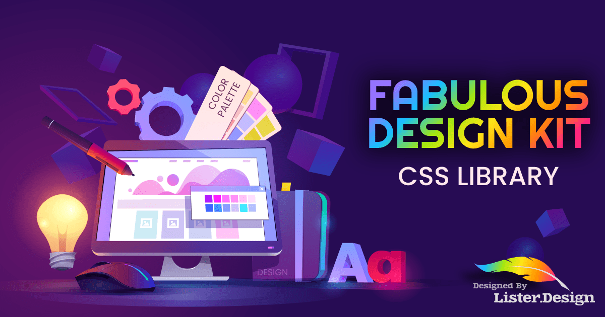

# Fabulous CSS Library

The **Fabulous CSS Library** is an elegant CSS stylesheet designed to streamline your work as a designer, making it faster, easier, and more accessible while ensuring compliance with web standards. Currently, it includes a CSS reset and basic typography defaults, with plans to add form styling and other utilities in the future.

## Getting Started

1. Clone the repository to your local machine.

2. You can use the styles in one of two ways:

   - **Incorporate the SCSS files into your existing build process:** If you prefer a more customized approach and have a build system in place, include the SCSS files to benefit from the Fabulous CSS Library's features. Customize them as needed to suit your project.

   - **Link the full or minified CSS files in your HTML document:** For a quick and hassle-free setup, link the provided CSS files directly in your HTML. You can choose between using the full version for development and the minified version for production.

## License

This project is licensed under the MIT License - see the [LICENSE](LICENSE) file for details.

## Fabulous Design Kit
**The Fabulous Favicon Generator**  is part of [The Fabulous Design Kit](https://lister.design/fabulous-design), a comprehensive suite of tools designed to assist web designers and developers in easily creating exceptional websites and applications that adhere to industry standards.